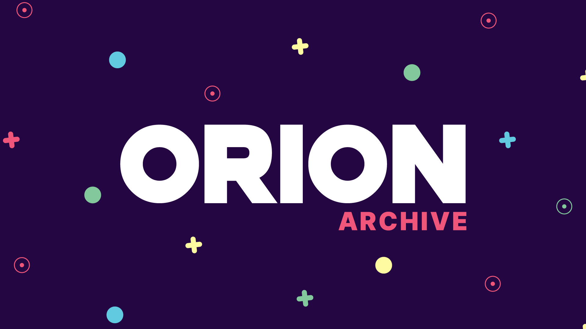
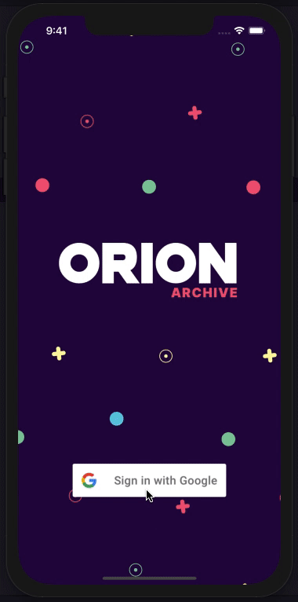
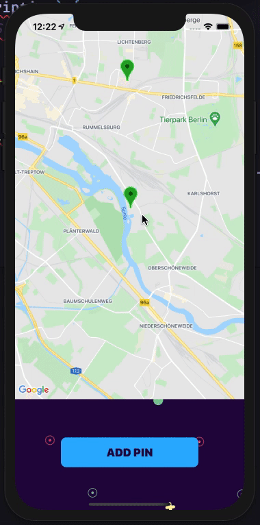
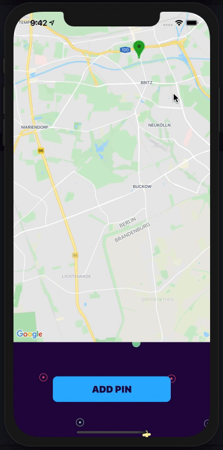

 

## Beta Stage

Team Orion Archive will strive to continuously release updates and additional features.

1. If you would like to contribute to this project:

   - Please feel free to <a href="https://github.com/Orion-Archive/Orion-Archive-Main/pulls">submit a PR</a>

2. If you happen to come across any issues while tinkering with the application:
   - Please <a href="https://github.com/Orion-Archive/Orion-Archive-Main/issues">report the bug/issue</a> by submitting a ticket located in the Issues Tab within this repository

 

## Getting Started

1.  Clone Orion Archive to your local machine and point to the Orion Archive directory:

        git clone https://github.com/Orion-Archive/Orion-Archive-Main.git

        cd Orion-Archive-Main

2.  Install all required dependencies with the following script:

        npm install

3.  Run the following scripts to open the Metro Builder for Orion Archive on http://localhost:19002:

        npm start

        npm run server

4.  Once Orion Archive is opened on http://localhost:19002, Download the <strong>Expo Client</strong> on your iPhone, then scan the QR Code that is viewable from the localhost or if you have xCode on your desktop, select <strong>Run on iOS simulator</strong> from the localhost menu.

5.  Replace the following end routes (with the updated routes after inserting your WIFI IP Address) for the 2 fetch requests located in <strong>Client > functions.js</strong>:

         http://INSERTYOURIPADDRESSHERE:3333/newMarker

         http://INSERTYOURIPADDRESSHERE:3333/getMarkers

 

## Main Features

### Branded Splash Screen - User Login (Google OAuth)

Users can use their google accounts to sign into Orion Archive to access the application's core features.

 

### The Atlas

After signing in, the user will have access to the atlas and will be able to explore around the interactive map to see all the event pins that other users that have contributed.

If you select on any pin, it will trigger an event details modal that will list all the events that are associated with that pin location. As of right now, we have the data hardcoded. The user could then add an event to that same pin or choose to exit the event details modal.

	

 

Instead of viewing other pins, the user could add a pin to the atlas as well. By selecting the add pin button located on the bottom of the screen, an add event modal will populate requesting the user to input an event title and description.

	

 

## Built With

- React Native
- Google OAuth
- Node.JS
  - Express
- PostgreSQL

 

## Core Team

<a href="https://github.com/wlstjs">Jinseon Shin</a>
 
<a href="https://github.com/JustinD-A">Justin Dury-Agri</a>
 
<a href="https://github.com/nicholasjs">Nicholas Shay</a>
 
<a href="https://github.com/sophiapak">Sophia Pak</a>

 

## License

This project is licensed under the MIT License
